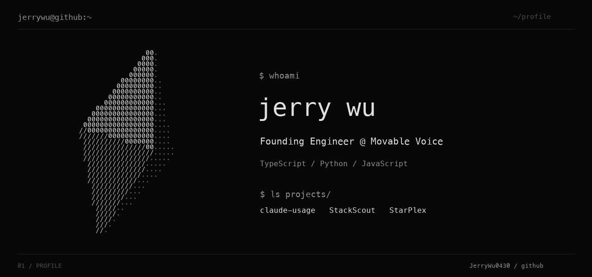

[View still artwork](assets/terminal.png)

### `$ cat about.txt`

I'm Jerry, a **Founding Engineer at [Movable Voice](https://movablevoice.com)**. I build developer tools and AI applications, mostly in TypeScript, Python, and JavaScript.

My public projects explore how developers work with AI: auditing Claude Code setups, recommending developer tools, and experimenting with interfaces like smart glasses. I also build at hackathons, with projects that have placed at Hack Nation, Perplexity London, and Mistral AI × Jump Trading.

### `$ ls projects/`

| Project | Notes |
| :--- | :--- |
| [claude-usage](https://github.com/JerryWu0430/claude-usage) | Audit the Claude Code skills, commands, plugins and MCP servers you actually use. |
| [StackScout](https://github.com/JerryWu0430/StackScout) | Developer-tool recommendations. 1st place in London, Hack Nation 4th. |
| [StarPlex](https://github.com/JerryWu0430/StarPlex) | 2nd place, Perplexity London Hackathon 2025. |
| [PolyBans](https://github.com/JerryWu0430/PolyBans) | Polymarket arbitrage with Meta Ray-Bans. 1st place, Best Use of Data, Mistral AI × Jump Trading. |

[All repositories ↗](https://github.com/JerryWu0430?tab=repositories)
